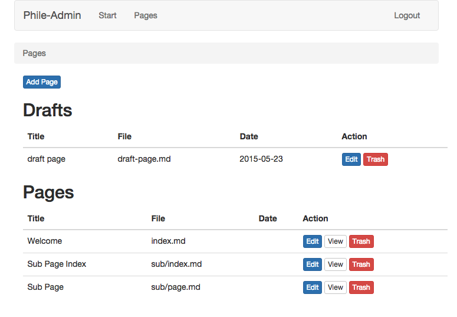
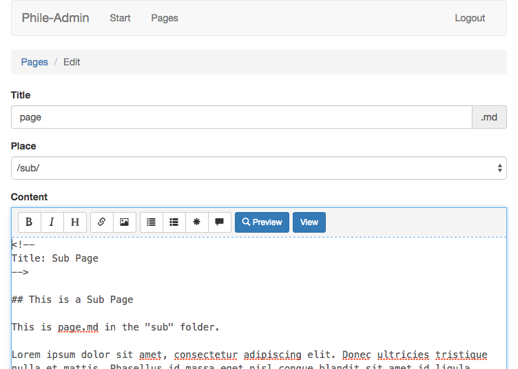

# Markdown Editor Plugin for Phile-Admin #

## What ##

A markdown editor plugin for [Phile-Admin].

- Create new pages
- Edit pages
- Move pages between folders
- Draft non-public pages
- Remove pages (files are not actually deleted but moved to special trash folder)

The page index:



The editor:



## Installation

### 1 Installation (composer) ###

```json
"require": {
	"siezi/phile-admin-markdown-editor": "*"
}
```

<!--

### 1.2 Installation (Download)

* Install [Phile](https://github.com/PhileCMS/Phile)
* Clone this repo into `plugins/siezi/phileMarkdownEditor`

-->

### 2. Activation

After you have installed the plugin you activate it by adding the following line to your `config.php` file:

```php
$config['plugins']['siezi\\phileAdminMarkdownEditor'] = ['active' => true];
```

This plugin depends on [Phile-Admin]. Make sure it’s activated too.

### 3. Config ###

See `config.php`.

[Phile-Admin]: https://github.com/Schlaefer/phileAdmin